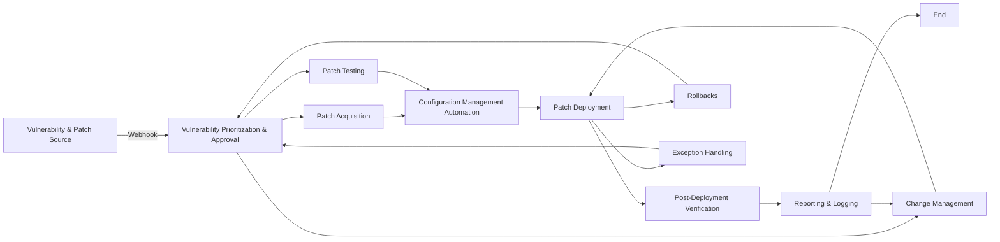

```mermaid
graph LR
A[Vulnerability & Patch Source] --> |Webhook|B[Vulnerability Prioritization & Approval]
B --> C[Patch Acquisition]
B --> D[Patch Testing]
C --> E[Configuration Management Automation]
D --> E
E --> F[Patch Deployment]
F --> G[Post-Deployment Verification]
G --> H[Reporting & Logging]
H --> M[End]
%%A --> I{scheduling}
B --> J[Change Management]
F --> K[Rollbacks]
F --> L[Exception Handling]
%% I --> B
J --> F
K --> B
L --> B
H --> J
```