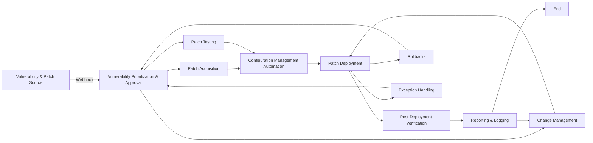

# Process Diagram For Vulnerability Management

## Primary Workflow

- Vulnerability & Patch Source (A): This process acts as the starting point, integrating with vulnerability feeds (e.g., webhooks) from vendors to identify potential threats.
- Vulnerability Prioritization & Approval (B): Here, automation prioritizes vulnerabilities based on severity, exploitability, and affected systems. Security teams can also manually review and approve critical vulnerabilities.
- Patch Acquisition (C): Once vulnerabilities are approved, the system automatically downloads the corresponding patches from vendor repositories.
- Patch Testing (D) (Optional): This step allows for automated or manual testing of critical patches in a designated environment before deployment.
Configuration Management Automation (E): This process utilizes tools like Ansible or Puppet to connect to target servers.
- Patch Deployment (F): Leveraging configuration management tools, approved patches are automatically deployed to the targeted servers.
Post-Deployment Verification (G): The system automatically verifies successful patch deployment on target systems.
- Reporting & Logging (H): The process generates reports on identified vulnerabilities, approved patches, deployment status, and potential errors. Logs are stored for future reference and auditing.
## Relationships and Automation Impact

- Scheduling (I): A dotted line connects scheduling to vulnerability prioritization, indicating it might influence how often vulnerabilities are assessed and prioritized. Automation can be used to schedule regular vulnerability scans.
- Change Management (J): A solid line connects vulnerability approval to change management. While automation prioritizes vulnerabilities, security teams might need to review changes (patch deployments) through a change management process before they are applied.
- Rollbacks (K) and Exception Handling (L): These dotted lines connect patch deployment to rollback and exception handling. Automation can be used to define rollback procedures in case of deployment issues and handle exceptions that prevent successful patching on some systems. Note: The placement of the J arrow suggests it might also be triggered by unsuccessful deployments requiring a change management review.

## Key Points

Automation prioritizes and facilitates the acquisition of patches based on identified vulnerabilities.
While automation streamlines the process, human intervention might be necessary for critical vulnerability approval and change management workflows.
Automation can be used for scheduling vulnerability scans, handling rollbacks in case of issues, and managing exceptions during deployment.
This highlights how automation plays a central role in identifying vulnerabilities, acquiring patches, and deploying them efficiently. However, it's important to maintain a balance between automation and human oversight, especially for critical vulnerabilities and change management processes.